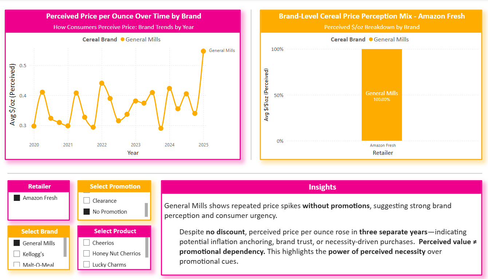
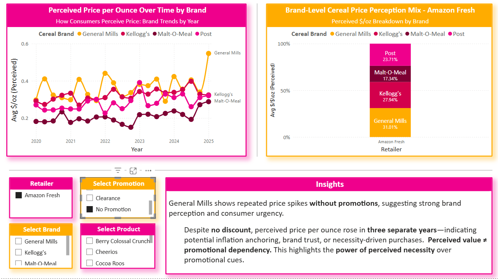
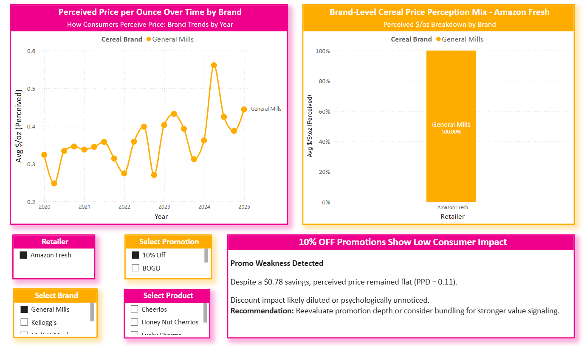
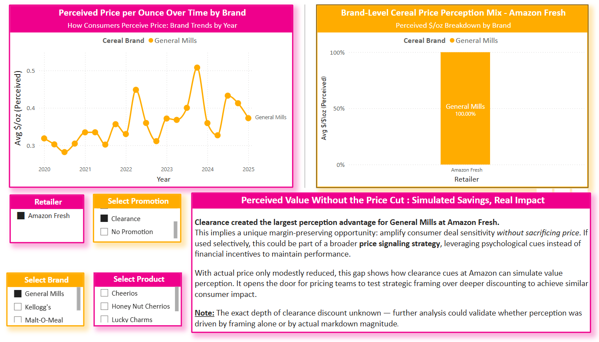

# 🧠 Behavioral Spotlight: Price Perception vs. Reality at Amazon Fresh

### Insight Theme: *Simulated Savings, Real Impact*

This insight was developed as part of an independent strategic business intelligence engagement, structured as a consultancy-style strategic pricing intelligence portfolio project.  
The analysis leverages real-world data structures, CPG retail frameworks, and behavioral pricing principles to deliver actionable market intelligence for brands and retailers navigating today’s complex pricing environments.

---

## Key Insight

Despite identical perceived and actual price per ounce values across multiple **BOGO** and **No Promotion** periods, **Price Perception Differences (PPDs)** for *General Mills at Amazon Fresh* varied significantly — uncovering a behavioral gap between promotional framing and actual savings.

---

## Visual 1: General Mills – No Promotion Price Spike (Amazon Fresh)

🔹 Multiple pricing spikes occurred in:
- Q1 2021  
- Q2 2022  
- Q2 2023  
- Q1 2025  

Despite **no active promotion**, perceived price rose and purchasing behavior remained strong — highlighting the role of **habitual purchasing**, **trust**, and **necessity-based urgency** in price tolerance.

---

## Visual 2: All Brands – No Promotion Trend Comparison (Amazon Fresh)

- *General Mills* maintains a **dominant perceived value** across Amazon Fresh, even without active promotions.
- This suggests consumers **internalize price worthiness** based on brand strength and category urgency.

---

## Visual 3: All Brands – 10% Off Promotions Show Low Consumer Impact

📉 Despite a $0.78 savings, perceived price remained flat (PPD = 0.11).  
Psychologically, the discount appears to be **unnoticed or undervalued**.

**Recommendation:** Reevaluate promotion depth or consider bundling for stronger value signaling.

---

## Visual 4: All Brands – Clearance Pricing Shows Strong Perception Lift

Clearance generated the largest perception advantage for General Mills.  
Even with **minimal price movement**, consumers perceived **greater value** — a strong cue for **framing-based strategies**.

---

## 🧠 Additional Reference

📎 [Price Perception Behavioral Logic](../Documentation/Price_Perception_Behavioral_Logic.md)  
Understand how **PPD (Price Perception Difference)** works, including behavioral and strategic implications.

---

## Takeaway

Consumers don’t just respond to price tags — they respond to **what the price means**.  
This spotlight decodes that meaning at Amazon Fresh, helping brands simulate perceived savings **without sacrificing real margin**.
