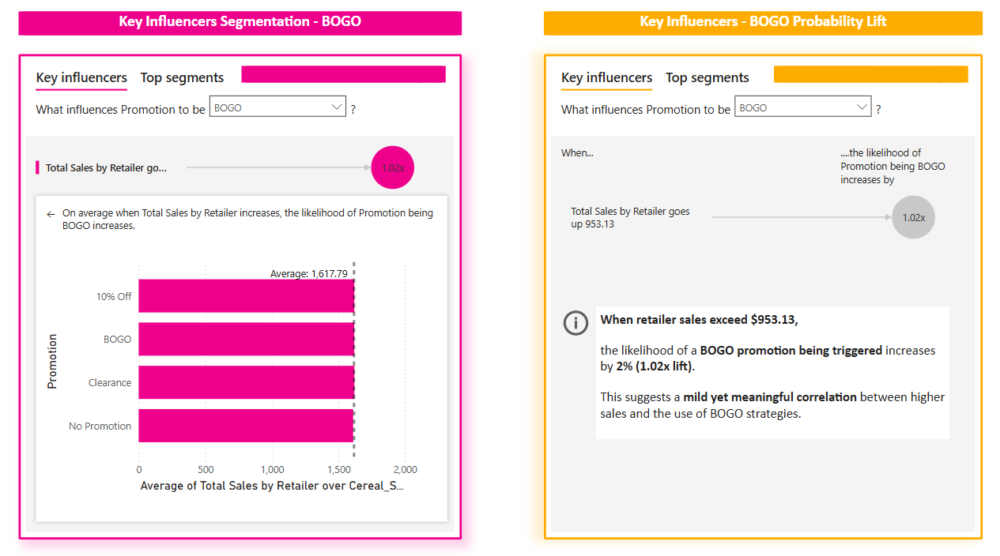

# Key Influencers Analysis – BOGO Trigger Likelihood & Promotion Segmentation

## Use Case Overview:
This analysis explores **when and where BOGO (Buy One Get One) promotions are most likely to be triggered** across retailers, based on total sales performance. By leveraging Power BI’s **Key Influencers visual**, we can detect subtle **probability lifts** that correlate with sales thresholds—revealing actionable moments when BOGO is more likely to appear in the dataset.

---

## Why This Matters:
Retailers and category managers often ask:
- When should we deploy a BOGO strategy?
- Are promotions being used proactively or reactively?
- Can we predict when a retailer is likely to trigger a specific promotion?

BOGO deals have different cost and margin trade-offs than other promotions like **10% Off** or **Clearance**. Understanding the **sales context in which they arise** is key for optimizing both **timing and profitability**.

---

## 📊 Visual Reference 1: BOGO Probability Lift



### Annotated Insight (Included in Visual):
> **When retailer sales exceed $953.13**,  
> the likelihood of a **BOGO promotion being triggered** increases by **2% (1.02x lift)**.  
>  
> This suggests a **mild yet meaningful correlation** between higher sales and the use of BOGO strategies.

---

## 📊 Visual Reference 2: BOGO Segmentation by Sales Bands


This view segments the data into percentile bands based on **Total Sales by Retailer** and ranks the segments by how often BOGO is triggered.

- **Segment 1 (26.3%)** includes sales totals between **$1,559.16 and $1,852.96**.
- This group accounted for **9.9% of the dataset** and shows the **highest likelihood of BOGO use**, slightly above the average of **25.1%**.
- Other segments follow closely, indicating that **BOGO is fairly evenly distributed**, but slightly more common in mid-to-upper sales tiers.

---

## Strategic Implications

- A 1.02x lift may **seem small**, but over **millions in sales volume**, this 2% increase can **meaningfully shift promotion planning.**
- For example, if a retailer moves $10M in cereal sales per quarter, a **2% higher BOGO likelihood** at the right threshold could affect **$200,000+** worth of promotional activity or customer behavior.
- **Retailers** might use this to:
  - Pre-plan promotional calendars based on forecasted sales spikes.
  - Evaluate BOGO readiness based on performance triggers.
  - Optimize promo sequencing (e.g., BOGO after strong non-promo month).
- **CPGs** might respond by:
  - Negotiating co-funding based on performance tiers.
  - Timing ad spend to align with BOGO likelihood windows.

---

## 🧠 Behavioral Interpretation

Promotions **are behaviors**—not just discounts.  
They’re **system-level responses** to perceived or forecasted demand, profitability pressures, and strategic positioning.

These visuals help us interpret **not just when promotions occur**, but **why**—and **how likely they are to occur** based on measurable, observable signals in the retail environment.

---

## 🗂 Suggested GitHub Placement
📁 `/Behavioral_Insights_Spotlights/`  
📄 `bogo_probability_lift.md`

---

## ✅ Summary

| Concept | Value |
|--------|-------|
| Threshold Trigger | $953.13 |
| BOGO Lift | 1.02x (2% increase in likelihood) |
| High-Likelihood Segment Range | $1,559.16–$1,852.96 |
| Segment BOGO Share | 26.3% (vs. 25.1% avg) |
| Strategic Signal | Mild but measurable trigger-based pattern |

---
```Strategically timed promotions aren’t accidents—they’re signals of underlying performance behavior. Learn how to read them.```
