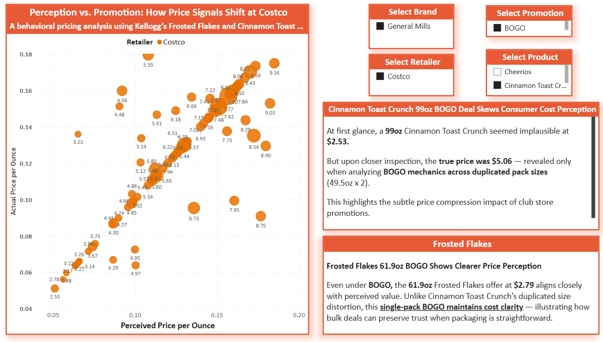
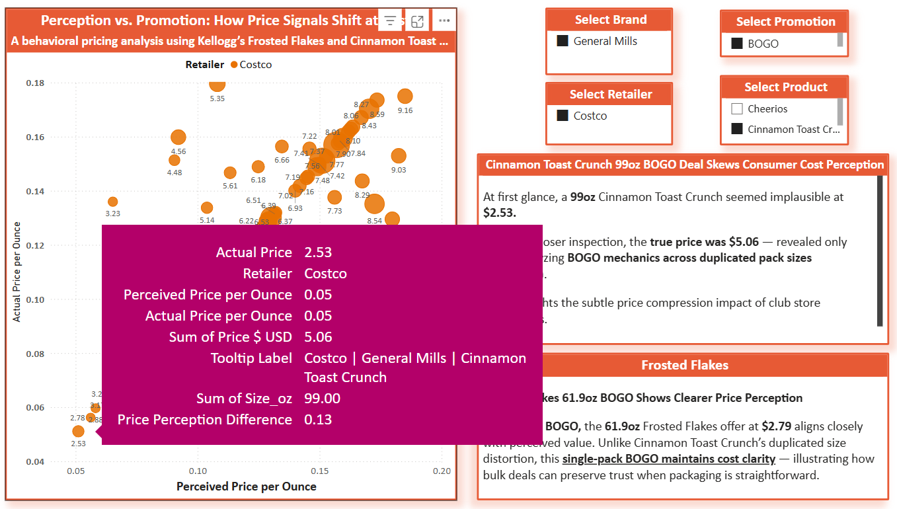
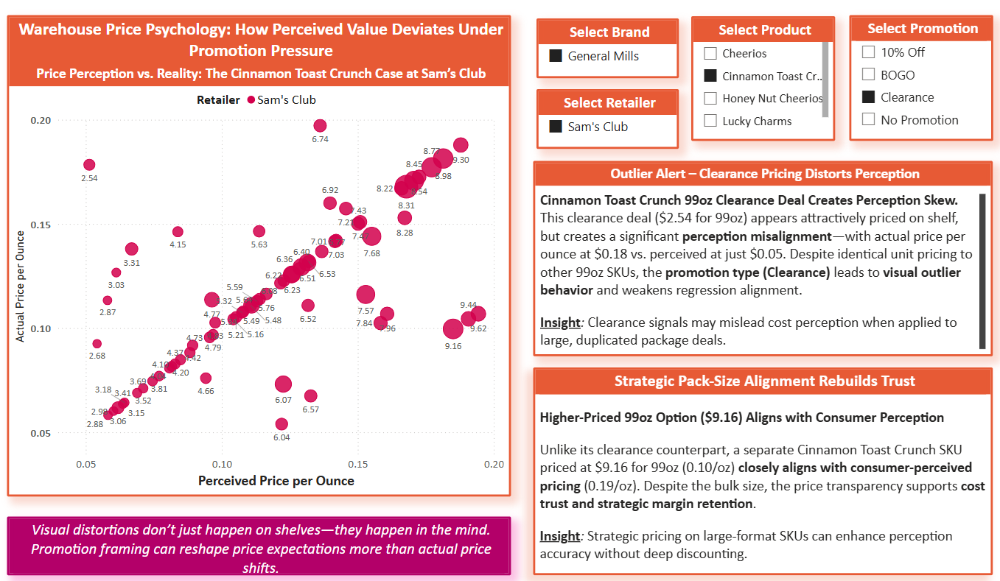
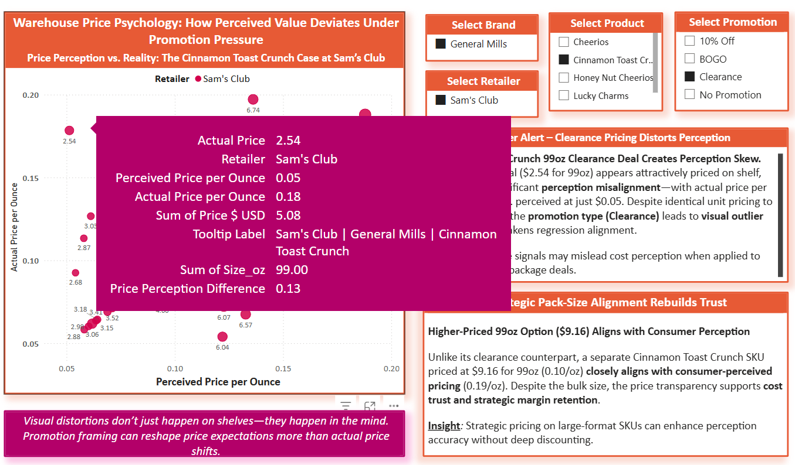

# Club Stores Price Perception Insight  
## Cinnamon Toast Crunch at Costco vs. Sam’s Club  
**Behavioral Pricing Insight: How Promotion Framing Skews Perception**

---

### 🧠 Overview
This markdown explores two nearly identical SKU offerings of General Mills’ Cinnamon Toast Crunch at **Costco** and **Sam’s Club**, highlighting how **promotion type** and **visual price structure** distort consumer cost perception—despite similar sizes and real costs.

This comparison draws on a broader behavioral pricing investigation from the **Cereal Market Evolution: Strategic Pricing, Market Intelligence & Consumer Psychology** project (2020–2025).

---

### Case 1: Costco — General Mill's Cinnamon Toast Crunch Perception Alignment with Transparent BOGO

- **Promotion Type:** BOGO  
- **Actual Price per Pack:** $2.53 × 2  
- **Total Size:** 49.5oz × 2 = 99oz  
- **Perceived Price per Ounce:** $0.05  
- **Actual Price per Ounce:** $0.05  
- **Price Perception Difference:** 0.00

#### ✅ Key Insight:
Despite the promotional framing (BOGO), Costco’s pricing maintains transparency. The **unit cost matches perception** due to clear dual-pack formatting and clean price labeling. This alignment supports **trust** and **regression integrity** in price-perception modeling.

---

### Case 2: Sam’s Club — General Mill's Cinnamon Toast Crunch Clearance Deal Distorts Price Perception

- **Promotion Type:** Clearance  
- **Actual Price per Pack:** $2.54 × 2  
- **Total Size:** 49.5oz × 2 = 99oz  
- **Perceived Price per Ounce:** $0.05  
- **Actual Price per Ounce:** $0.18  
- **Price Perception Difference:** +0.13

#### Key Insight:
While the clearance price appears low, it **masks true cost** due to **duplicated packaging structure**. Unlike Costco’s explicit BOGO, the Clearance tag here creates **visual price compression**, misleading consumers into thinking they’re getting a better deal than they are.

---

### 🧠 Behavioral Reflection
Although both stores offered the **same size and nearly identical price**, the difference in **promotion type** led to dramatically different **perception vs. reality outcomes**:

- **Costco** → Clear BOGO structure = **consumer trust retained**
- **Sam’s Club** → Clearance tag = **perception skew & visual outlier**

This distinction illustrates a broader theme in behavioral economics:  
> “Visual distortions don’t just happen on shelves—they happen in the mind.”  

---

### 🧠 Strategic Takeaways
- **Promotion Clarity Matters:** Retailers must recognize how perceived value is shaped by framing—not just raw price.
- **Outliers Need Context:** Analysts should investigate outlier points instead of default removal—behavioral clues often reside there.
- **Excel Cross-Validation Adds Depth:** Identifying exact transaction dates, Entry_IDs, and batch detail clarified data origins.
- **Tooltip-Level Analysis = Discovery:** Tooltip metrics revealed **hidden pricing behavior** that would be missed in raw visuals alone.

---

> **Strategic Note:**  
> The clearance pricing behavior observed at Sam’s Club in 2020 for Cinnamon Toast Crunch appears to be an isolated, low-volume event — with only two identical entries recorded on the same date. Notably, this occurred during the early pandemic period when supply chain uncertainty and reduced foot traffic may have driven temporary liquidation efforts.  
> 
> While it may not reflect a deliberate pricing strategy, it underscores the importance of monitoring historical anomalies. Even unintentional discounting patterns can contribute to long-term price perception shifts, particularly for high-equity products like CTC. CPGs should consider including this level of transactional context when evaluating promotional impact on consumer trust.

---

🔍 **Visual Source**: Power BI scatterplot — *Perceived Price per Ounce vs. Actual Price per Ounce*  
🧠 **Project Context**: Cereal Market Evolution (2020–2025), Strategic Pricing & Behavioral Analysis  
