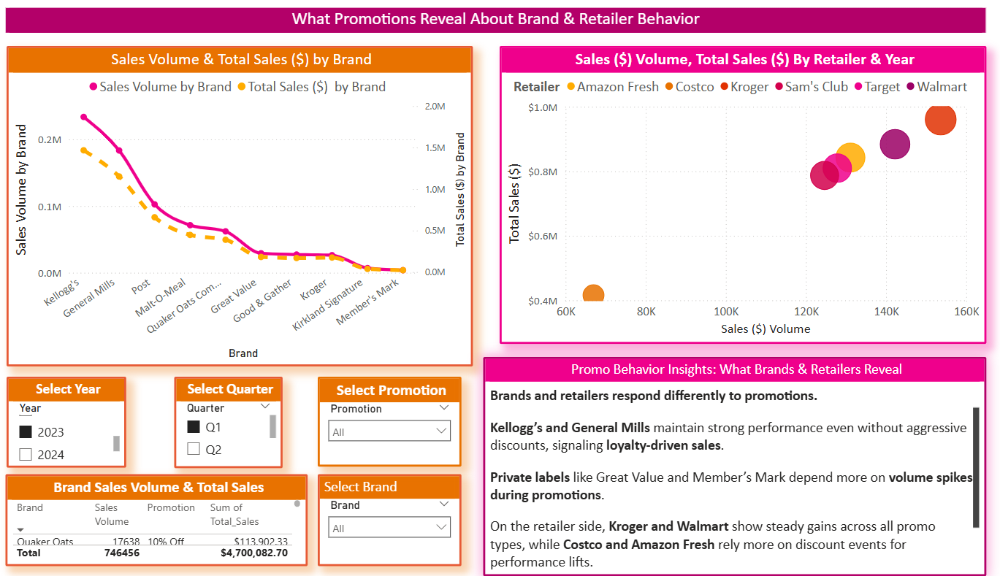

# 🧠 Behavioral Insights Spotlight  
## Q1 2023 Promotion Response: Brand & Retailer Dynamics

This spotlight analyzes **Q1 2023 promotional behavior** to reveal how brands and retailers respond to different price incentives. Using key Power BI visualizations, we evaluate the **total sales volume, retailer segmentation, and probability-based promotion lift** to understand what drives performance at the brand and store level.

---

### 📊 Visual 1: Brand vs. Retailer Dynamics  

- **Kellogg’s and General Mills** showed strong volume and revenue even without deep discounting, suggesting **loyalty-driven behavior**.
- **Private labels** like Great Value and Member’s Mark saw **volume spikes during promotions**, indicating deal sensitivity.
- **Kroger and Walmart** demonstrated steady gains across all promo types, while **Amazon Fresh and Costco** relied more heavily on **discount-event driven lifts**.

🧠 **Behavioral Insight:**  
> Brand value perception and retailer price positioning shape how promotions influence total performance.  
> Some brands succeed with less reliance on promotions, while others depend heavily on deal timing to capture demand.

---

### 📊 Visual 2: Probability Lift – BOGO Trigger Threshold  

- A **1.02x probability lift** was observed when retailer sales exceeded **$953.13**, making it **2% more likely** that a **BOGO promotion** would be triggered.
- This reveals that even modest sales gains can lead to **statistically meaningful shifts** in retailer behavior.
- The lift may seem small in isolation, but scaled across thousands of transactions, it may signal **promotion readiness thresholds** for high-volume retailers.

🧠 **Behavioral Insight:**  
> Retailers appear to use sales velocity as a signal to activate BOGO campaigns—especially when nearing $1M revenue benchmarks.  
> Even a **2% lift** can be operationally significant at scale.

---

### 📊 Visual 3: Strategic Sales Insights by Promotion Type  

- **Q1 2023** was the highest performing quarter with **$4.7M** in total sales. **Kellogg’s alone contributed $1.47M**.
- **No Promotion periods outperformed** 10% Off and Clearance in many cases, suggesting **necessity-based or habitual purchasing**.
- **BOGO** rivaled other discounts but offered **stronger dollar efficiency**, especially at Amazon Fresh.

 **Strategic Callout:**
- **Don’t underestimate the “No Promotion” behavior.**  
- **Promotions should be behaviorally anchored—not just transactionally tempting.**

---

### 🧩 Final Takeaway

The combination of these visuals builds a powerful behavioral portrait:
- **Brand strength** vs. **promotional dependence**
- **Retailer segmentation** by lift threshold
- Real-time triggers that shape **promotion deployment strategy**

Retailers and CPGs can use these behavioral cues to:
- Time promotions more effectively  
- Understand when **BOGO offers** are most likely to land  
- Reassess blanket discounting strategies like **10% Off**, which may not drive desired performance

---

📁 **Suggested GitHub Folder:**  
`/Behavioral_Insights_Spotlight/`

🖼️ **Image Assets:**  
- `Images/Q1_2023_Total_Sales_Vol_Brand_Retailer_Promo.png`  
- `Images/Key_Influencers_BOGO.png`  
- `Images/Q1_2023_Promotion_Impact_Insight.png`

