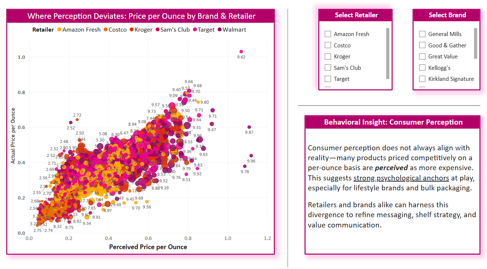
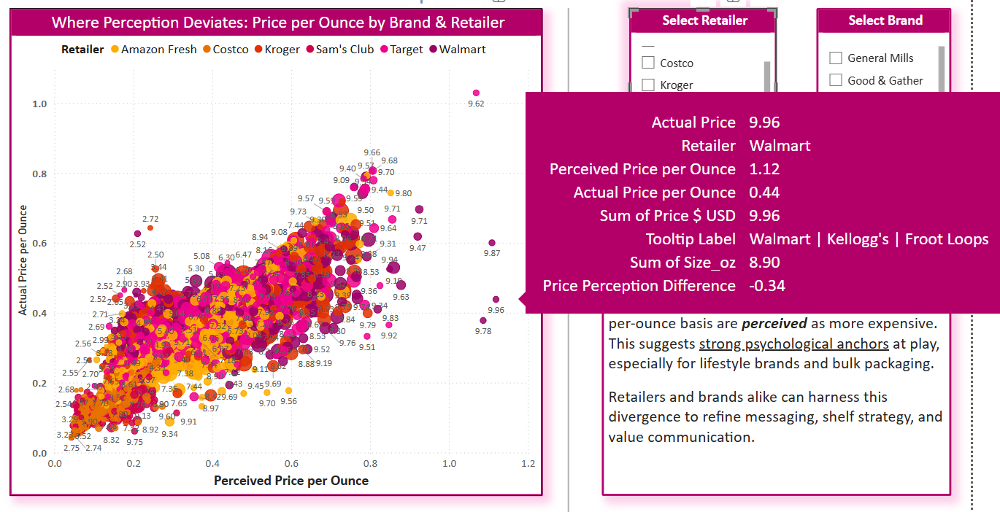

# Behavioral Economics Spotlight  
## Price Perception, Identity & the Psychology of Brand Trust  

---

### Purpose  
This spotlight explores how consumer psychology distorts real-world price perception, using cereal brand data to reveal the deeper behavioral mechanics behind what people think they’re paying — and why. It complements the **Price Expectation vs. Reality scatter plot** in Power BI and sets the stage for actionable strategy.

> **Why Behavioral Spotlights Matter:**  
> In today’s inflation-sensitive economy, *understanding how consumers think* is just as critical as tracking what they buy. These behavioral spotlights illuminate the hidden drivers of consumer decision-making — like brand trust, price anchoring, and perceived value — that often escape traditional sales dashboards.  
>
> For **CPG brands**, this means identifying where emotional loyalty outweighs price competition.  
> For **retailers**, it reveals which product-price perceptions can be amplified to build trust or justify pricing tiers.  
> For **pricing and market intelligence analysts**, it unlocks a deeper lens for strategy — bridging behavioral economics with tactical execution.

---

### What the Data Shows  

This scatterplot illustrates the deviation between **perceived price per ounce** and **actual price per ounce** across retailers and brands. While many products follow a tight alignment along the regression trendline, select cereals deviate significantly — especially in cases of **brand-driven perception bias**.

---

### Questions This Spotlight Begins to Answer

- What do pricing perception gaps tell us about consumer trust in brands?  
- Are shoppers truly price-sensitive, or do they just want to feel confident in their choices?  
- When is overestimating a product’s price actually a *good* thing for a brand?  
- How can retailers and CPGs use perceived value to position products more effectively?

---

### Behavioral Pricing Insight  

In analyzing perceived vs. actual price per ounce, we found that some products — like **Froot Loops (Kellogg’s)** — appear as outliers **below** the invisible regression line, meaning:

> Shoppers consistently **overestimate** the price per ounce — believing the cereal is more expensive than it really is.

This overestimation reflects **anchoring bias** and **brand trust**, not confusion or misinformation. Legacy brands, particularly those rooted in childhood nostalgia, evoke a subconscious association with quality and value.

---

### 💬 What This Really Means  

While this seems counterintuitive at first (wouldn’t trust lead to underestimation?), we see something else at play:

- **Price is perceived as a signal of quality**  
- Consumers associate national brands with **premium value**  
- Even when prices drop, **mental price memories** often lag  

This effect allows legacy brands to retain **premium perception** even at non-premium price points.

---

### Case Example: Froot Loops at Walmart – Brand Identity & Price Trust  

A key data point illustrates this phenomenon in action:

- **Retailer:** Walmart  
- **Brand/Product:** Kellogg’s | Froot Loops  
- **Perceived Price per Ounce:** $1.12  
- **Actual Price per Ounce:** $0.44  
- **Total Price:** $9.96  
- **Box Size:** 8.90 oz  
- **Price Perception Difference:** –$0.34  

Despite its affordability, **Froot Loops is mentally framed by shoppers as a “premium brand”** due to long-standing emotional trust and recognition. The small packaging and shelf presence may amplify the illusion of higher cost, reinforcing the consumer’s belief in quality.

---

### ⚡ Real-Time Analyst Breakthrough  

During this analysis, I recognized one of my own implicit biases:  
I initially assumed all consumers are price-sensitive and view high price per ounce negatively. But in reality, many customers **welcome premium pricing** — as a signal of trust, status, lifestyle, or stability.

> A perceived $1.12/oz price on a $0.44/oz cereal doesn’t trigger dissatisfaction — it reinforces a *feeling* of quality and security.

For these consumers, paying more (or thinking they are) is part of the **emotional experience** of buying trusted brands.

---

### Behavioral Takeaway  

This dataset reminded me that pricing is not only about affordability — it's about **identity construction**.

- Some consumers avoid high prices  
- Others **embrace them**, as symbols of reliability and even self-worth  
- And brands that understand that can position with *precision*

---

### 📎 Related Visual  
[📊 Price Expectation vs. Reality Scatter Plot](../Images/price_expectation_vs_reality_scatter_plot.png)

---

---

### 🔍 Additional Questions for Analysts & Strategists

- What can perception vs. reality analysis reveal that traditional pricing models miss?
- Where might behavioral misalignment be inflating or masking actual cost concerns?
- How do brand nostalgia and pricing memory shape buying behavior post-inflation?
- What legacy products are protected by overestimation — and can store brands replicate that?

> 💭 These are the kinds of questions pricing leaders and analysts should be asking when perception doesn’t align with price reality — because *where perception deviates, strategy lives*.

---

### ✅ Next Step  
See the corresponding [Strategic Recommendation on Perceived Value & Brand Positioning](../Strategic_Recommendations/price_perception_strategy.md)

