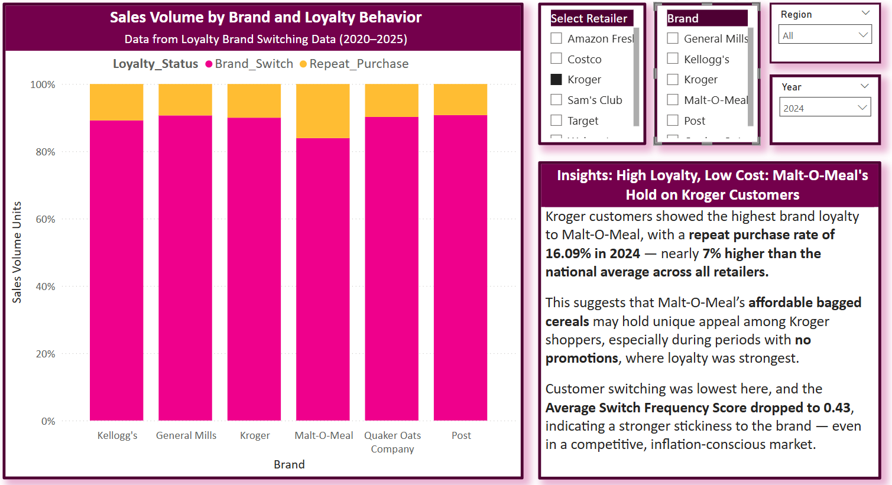
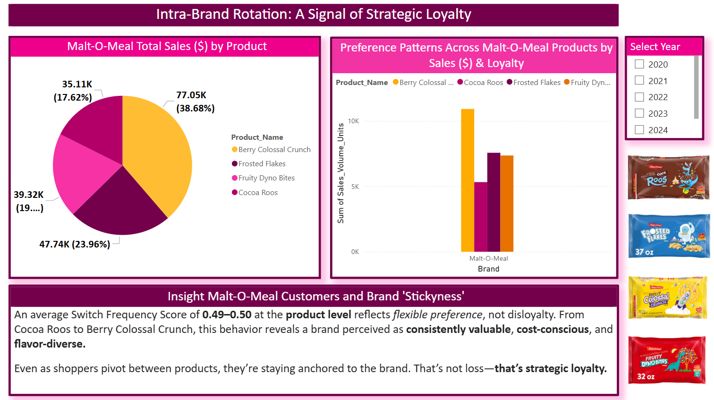

# Insight: Malt-O-Meal's Intra-Brand Switching & Loyalty Strength (2024)

📂 Visuals Referenced:
- `MOM_Loyalty_Switching_Sales_2024.png`
- `MOM_Intrabrand_Rotation_Loyalty.png`

---

## 🟪 Summary

In the final phases of brand loyalty analysis, **Malt-O-Meal (MOM)** unexpectedly emerged as a *Hero Brand* in the budget cereal segment — not just holding its ground against private labels like Kroger Brand and Great Value, but **outperforming national brands like Quaker Oats** in total sales and brand loyalty **within the dataset scope.**

Two product standouts — **Frosted Flakes** and **Berry Colossal Crunch** — revealed how MOM is quietly winning over budget-conscious customers *without heavy promotions or national-level branding spend.*

---

## 🟦 Key Findings

### 🟢 MOM's Frosted Flakes (All Retailers, 2024)
- **Repeat Purchase Rate:** **17.49%** — the highest for any MOM product in 2024
- **Switch Frequency Score:** **0.39** — indicating *strong brand stickiness*
- **Retailer Spotlight (Kroger):** Kroger drove the highest loyalty with MOM Frosted Flakes (16.09%) and the lowest switching score (0.34) of the entire dataset.
  
 **Implication:** This suggests MOM Frosted Flakes has achieved loyalty parity (or dominance) over national brand equivalents, especially within Kroger stores.

---

### 🟢 MOM’s Berry Colossal Crunch (All Retailers, 2020–2025)
- **Top-Selling MOM Product:** $484,974 (42.15%) in 2021
- **Average Sales Share (2020–2025):** **40.8%** of total MOM sales
- **Switch Frequency Score:** **0.53** → highest among MOM products, yet *still below industry switching norms*
  
 **Implication:** Berry Colossal Crunch functions as both a gateway product and loyalty anchor — possibly **cannibalizing Cap’n Crunch Berries (Quaker Oats)** due to identical flavor and packaging perception at a better price-per-ounce.

---

## 🟦 Behavioral Takeaway

> Even when customers “switch” within the MOM product line, they remain anchored to the brand — this isn’t disloyalty, it’s **flavor flexibility** within a trusted, budget-friendly portfolio.

This pattern of **intra-brand loyalty** suggests that MOM is **not losing customers**, but rather strengthening retention through flavor variety and value.

---

## 🟪 Strategic Note

This insight supports a broader strategic opportunity for both:
- **Retailers** (e.g., Kroger) seeking high-retention, private-label-alternative products.
- **MOM (Post Consumer Brands)**, which can position Frosted Flakes and Berry Colossal Crunch as *hero products* across regional and national markets.

A dedicated strategy breakdown for both Retailer and Brand layers will be documented in a future insights file:
🟢 [**Strategic_Recommendations.md**](#) *(link will be updated when published)*

---
