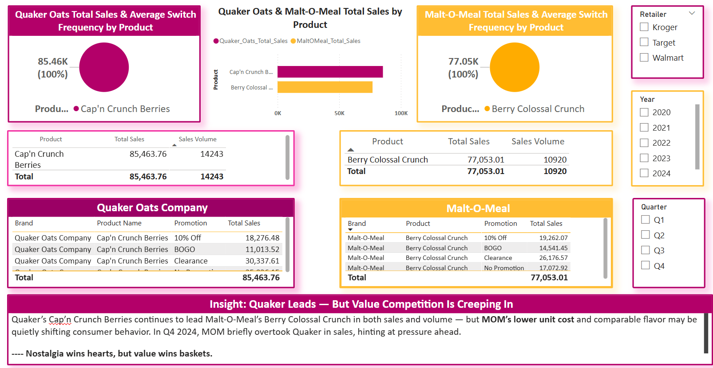

# 🍓 Cap’n Crunch Berries vs. Berry Colossal Crunch – Loyalty Performance Comparison (2020–March 2025)

**Visual Reference:**  

---

## Overview  
This insight compares **Quaker Oats Company’s Cap’n Crunch Berries (QOC-CCB)** against **Malt-O-Meal’s Berry Colossal Crunch (MOM-BCC)** across key performance indicators — **Total Sales**, **Sales Volume**, **Switch Frequency**, and **Promotional Trends** — using the **Loyalty Brand Switching Dataset** only.

To ensure **product-level parity**, only these two nearly identical cereal products were included. MOM has a larger product portfolio, but isolating BCC vs. CCB enables a more apples-to-apples evaluation of brand and product performance.

---

## 🧠 Key Takeaways

### 🔹 1. **Quaker Cap’n Crunch Berries Leads in Sales and Volume**
- **QOC-CCB Total Sales:** $5.19M  
- **MOM-BCC Total Sales:** $4.49M  
- **QOC-CCB Sales Volume:** 886,681 units  
- **MOM-BCC Sales Volume:** 752,502 units

QOC’s Cap’n Crunch Berries consistently outperformed MOM’s Berry Colossal Crunch across **each year from 2020–2025**, in both total revenue and sales volume.

---

### 🔹 2. **MOM BCC Gained Momentum in 2023, Narrowing the Gap**
- **2023 Sales:**  
  - QOC-CCB = $620,999.69  
  - MOM-BCC = $524,860.90  
- **2023 Volume:**  
  - QOC = 101,514 units  
  - MOM = 88,965 units  

2023 marked MOM’s strongest year — its closest point to overtaking QOC in performance. However, QOC held the lead.

---

### 🔹 3. **Promotion Type Impacts Sales Differently**
- QOC’s highest promo driver: **Clearance** & **No Promotion**
- MOM’s strongest returns: **10% Off**, followed by **Clearance**

Despite promotional overlaps, **MOM’s BCC is packaged larger** and often offers a **lower price per ounce**, which may sway cost-conscious consumers.

---

## Pricing Insight (Across Brand Portfolio)
| Metric | QOC | MOM |
|--------|-----|-----|
| Avg. Price/Unit | $5.82 | $5.90 |
| Avg. Price per Ounce | **$0.29** | **$0.20** |

This shows that **MOM offers more volume for a similar price**, while QOC carries a **higher unit cost per ounce**, despite a lower shelf price in some cases.

---

## 🧠 Strategic Implication  
Quaker’s strong brand recognition keeps it ahead in loyalty-based metrics — **but MOM is closing the gap through affordability and size perception**. As economic pressure builds, MOM may gain further ground unless Quaker improves promotional clarity, adjusts packaging strategies, or invests in loyalty incentives.

---

🔗 *Note:* A full strategic recommendation based on this analysis will be included in the upcoming **`strategic_recommendations.md`** file and cross-linked here when published.
