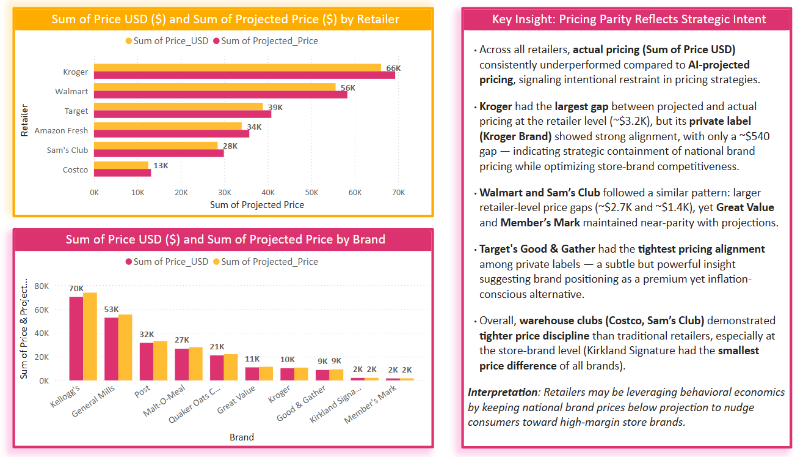
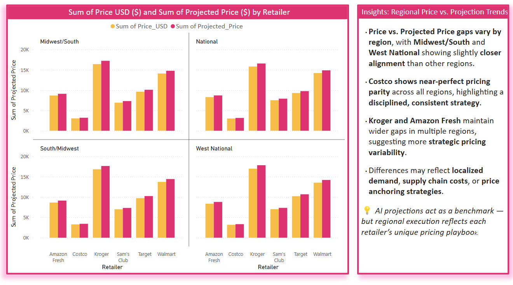

## 🧠 AI-Driven Price vs. Actual Price – Strategic Insights

This analysis compares **AI Projected Pricing** against **Actual Pricing (Sum of Price USD)** across both **Retailers** and **Brands**, surfacing key behavioral and strategic patterns in execution.

---

### 📊 Sum of Price vs. Projected Price by Retailer and Brand

- **Actual pricing consistently underperformed** compared to AI-projected pricing, signaling **intentional restraint** in execution.
- **Kroger had the largest overall gap** (~$3.2K), yet its **store brand (Kroger Brand)** was tightly aligned (~$540 gap).
- **Walmart and Sam’s Club** showed retailer-level gaps (~$2.7K and ~$1.4K), but **Great Value** and **Member’s Mark** had near-parity pricing.
- **Target’s Good & Gather** had the **tightest alignment** among private labels — premium image, inflation-aware execution.
- **Warehouse clubs (Costco, Sam’s Club)** showed **disciplined pricing**, especially on store brands — **Kirkland Signature** had the **smallest difference** (~$91).

📌 **Interpretation:** Retailers may be using behavioral economics by keeping national brand prices below projection to nudge consumers toward store brands.

---

### 🌎 Regional Price vs. Projected Price Trends

- **Price vs. Projected Price gaps vary by region**, with **Midwest/South** and **West National** showing closer alignment.
- **Costco** consistently shows **near-perfect pricing parity**, suggesting a uniform national pricing strategy.
- **Kroger and Amazon Fresh** show **higher pricing variability** by region — a more adaptive approach.
- Differences likely reflect **localized demand, supply chain costs**, and **anchoring behavior**.

💡 **AI projections serve as the benchmark — execution shows how strategy unfolds across the real-world landscape.**

