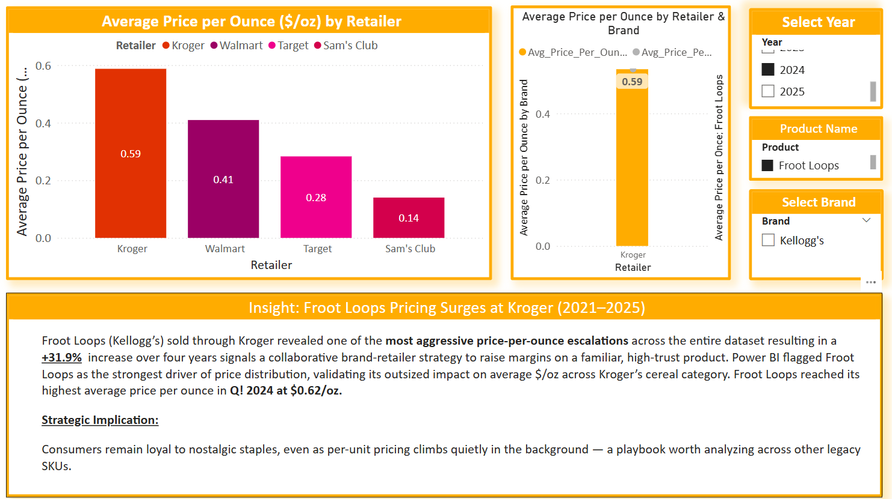

# 📊 Insight Series: Price Per Ounce, Value Perception & Shrinkflation

This insight set reveals the hidden cost dynamics behind shelf pricing, unit pricing, and psychological value perception across brands and retailers.

---

## 📌 Visual 1: Average Brand Price & Price per Ounce by Brand

📁 **Filename:** `Average_Brand_Price_Package_Price_per_Ounce.png`

### 🔍 Key Insights:
- Shelf price alone misleads. Store brands with low sticker prices (e.g., $2.97) often have **higher unit costs** than national brands.
- **Kroger Private Label** leads with the highest $/oz among store brands at **$0.42/oz**.
- **Quaker Oats** shows a high $/oz ($0.29) despite its low average shelf price — signaling potential shrinkflation.
- **Malt-O-Meal** and **club brands** (e.g., Kirkland, Member’s Mark) outperform on value, with **$/oz as low as $0.17**.

---

## 📌 Visual 2: Average Price per Ounce by Retailer

📁 **Filename:** `Average_Price_per_Ounce_Retailer.png`

### 🔍 Key Insights:
- **Club stores (Costco, Sam’s)** remain the lowest in $/oz due to bulk pricing.
- **Walmart** leads traditional retailers on price per ounce ($0.34), beating **Target** and **Kroger**.
- **Kroger** has the highest average $/oz among standard grocers — driven largely by house brand pricing.
- This demonstrates how **shoppers may be overpaying per ounce at familiar retailers** without realizing it.

---

## 📌 Visual 3: Price per Ounce – Kroger Froot Loops (2021–2025)

📁 **Filename:** `Average_Price_per_Ounce_FrootLoops_Kroger.png`

### 📍 Insight: Froot Loops Pricing Surges at Kroger (2021–2025)

Froot Loops (Kellogg’s) sold through Kroger revealed one of the **most aggressive price-per-ounce escalations** across the entire dataset.  
A **+31.9% increase over four**
