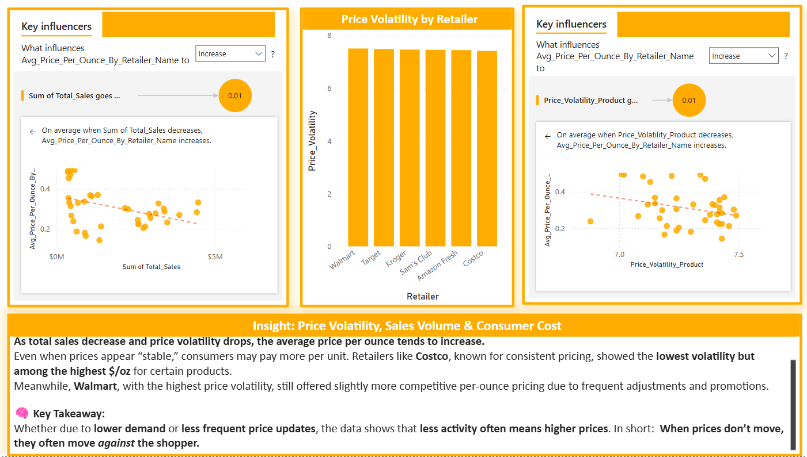

# 📉 Price Volatility & Influencer Insights: Sales Volume and Consumer Cost

### 💡 Key Finding: Lower Activity Often Means Higher Prices

As total sales decrease and price volatility drops, the **average price per ounce increases**. Power BI Key Influencer visuals reveal that both **lower sales volume** and **reduced price volatility** correlate with higher unit costs across retailers.

---

## 🧠 Insight 1: What Drives Price Per Ounce Increases?

### Key Influencer – Sales Volume
- When total sales **decrease**, average price per ounce **increases**.
- This inverse relationship suggests that reduced consumer activity (lower demand) leads to **less price competition**, pushing unit costs upward.

### Key Influencer – Price Volatility
- As price volatility **decreases**, average price per ounce **increases**.
- Retailers with “stable” pricing (like Costco) often show **higher per-unit costs**, despite appearing more predictable.

---

## 🔎 Price Volatility Ranking by Retailer

| Retailer       | Price Volatility |
|----------------|------------------|
| **Walmart**     | 7.50             |
| Target         | 7.48             |
| Kroger         | 7.46             |
| Sam’s Club     | 7.45             |
| Amazon Fresh   | 7.43             |
| **Costco**      | 7.41             |

Despite having the **lowest volatility**, Costco exhibited **some of the highest $/oz values** in the dataset, especially for select national brand cereals.

Meanwhile, Walmart—while **most volatile** in pricing—still maintained **competitive unit prices**, likely due to more frequent promotions and adjustments.

---

🧠 **Narrative Insight: The Volatility Paradox**

Power BI's AI-driven analysis reveals a striking insight: when total sales decline, the average price per ounce increases. This contradicts conventional consumer logic, which assumes prices rise due to high demand. Instead, the data shows that even in times of decreased demand and sales, prices go up.

💡 **Model Highlights:**
- A **drop of $1.29M in total sales** correlates with a **$0.01/oz increase** in price.
- **Decreases in product-level price volatility** are also associated with **higher unit costs.**

### 🧩 So what does this mean?

This reveals **demand-agnostic pricing power**—prices are raised to **offset low demand**, not just to respond to high demand.

It reinforces the **perception control** retailers exercise: **prices may appear stable**, but unit costs can quietly rise. This behavior supports **margin recovery without price visibility** to the consumer.

> **Volatility isn’t just about price movement—it’s about behavioral economics, margin strategies, and psychological misdirection.**

## 🧠 Key Takeaway:
> **When prices don’t move, they often move *against* the shopper.**  
Whether due to **lower demand** or **infrequent pricing updates**, less activity is associated with **higher average prices**.

This reinforces the strategic benefit of **price dynamism**—for both retailers and consumers.
