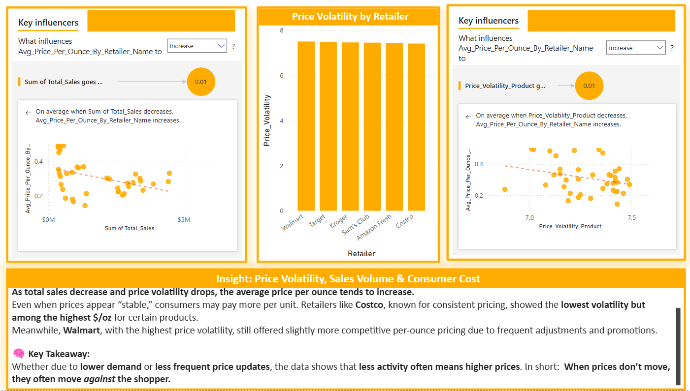

# 💹 Price Volatility & Key Influencers: Understanding Consumer Cost

### 🧠 Key Finding: Lower Volatility Doesn’t Mean Lower Prices

This visual combines **Price Volatility by Retailer** with **Key Influencer analysis**, revealing that:

- **As total sales decrease**, the **average price per ounce increases**  
- **As price volatility decreases**, the **average price per ounce increases**

While stability may seem beneficial, **stable prices often reflect higher unit costs**—especially among warehouse clubs.

---

### 🟨 Insight 1: Price Volatility Across Retailers

Retailer-level volatility scores:
- **Walmart:** 7.50 (most price changes)
- **Target:** 7.48  
- **Kroger:** 7.46  
- **Sam’s Club:** 7.44  
- **Amazon Fresh:** 7.42  
- **Costco:** 7.41 (least volatile)

Warehouse clubs (Costco, Sam’s) offer fewer price changes—but their price per ounce may be *higher*, as shown in prior visuals.

---

### 💡 Insight: Price Volatility, Sales Volume & Consumer Cost

**As total sales decrease and price volatility drops, the average price per ounce tends to increase.**  
Even when prices appear “stable,” consumers may pay more per unit. Retailers like **Costco**, known for consistent pricing, showed the **lowest volatility but among the highest $/oz** for certain products.

Meanwhile, **Walmart**, with the highest price volatility, still offered slightly more competitive per-ounce pricing due to frequent adjustments and promotions.

---

### 🧠 Key Takeaway:
> Whether due to **lower demand** or **less frequent price updates**, the data shows that **less activity often means higher prices.**  
> In short: **When prices don’t move, they often move *against* the shopper.**
