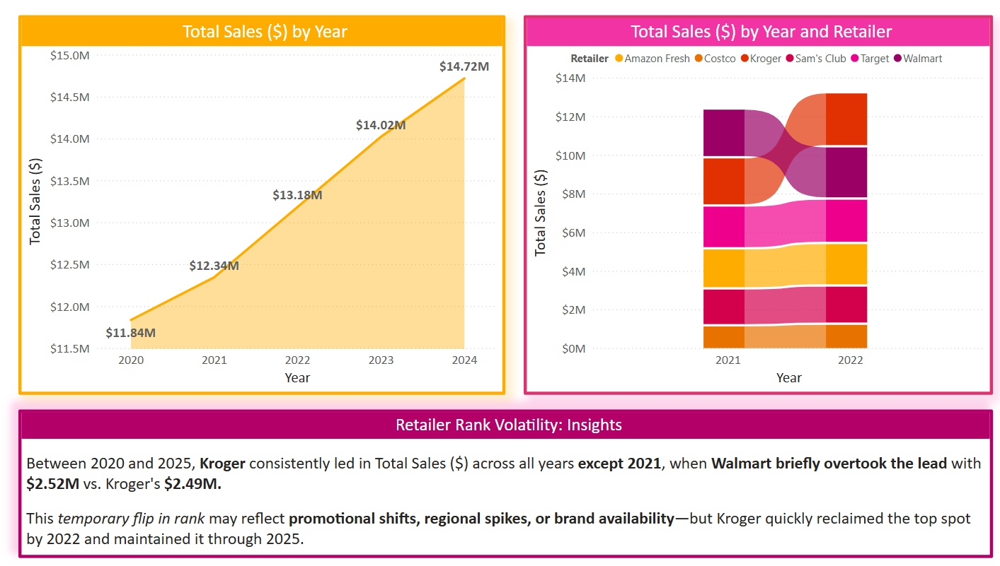

# 📊 Retailer Rank Volatility: Sales Leadership Over Time

### Key Insight: Kroger Dominated Sales—But Walmart Briefly Took the Lead

This analysis compares **total sales by year** and **retailer-level rank fluctuations**, offering a visual snapshot of annual growth and competitive dynamics.

---

### 📈 Insight 1: Total Sales Growth Over Time

The line chart shows steady sales growth between **2020 and 2024**, climbing from **$11.84M** to **$14.72M**. This upward trend highlights sustained market performance across retailers.

---

### 🧠 Insight 2: Ribbon Chart Reveals Competitive Rank Shifts

Between 2020 and 2025, **Kroger** consistently led in total sales ($) across all years **except 2021**, when **Walmart briefly overtook the lead** with **$2.52M** vs. Kroger's **$2.49M**.

This **temporary flip in rank** may reflect:
- Promotional timing or campaign performance  
- Regional demand spikes  
- Short-term product availability issues  

By 2022, Kroger reclaimed the top spot and **maintained its lead through 2025**, showcasing strong price positioning and consumer trust.

---

### 🎯 Strategic Implication

Retailer rank volatility can signal deeper market shifts—knowing **when and why** a retailer rises or falls helps brands and retailers fine-tune pricing, supply chain timing, and promotional strategies.
