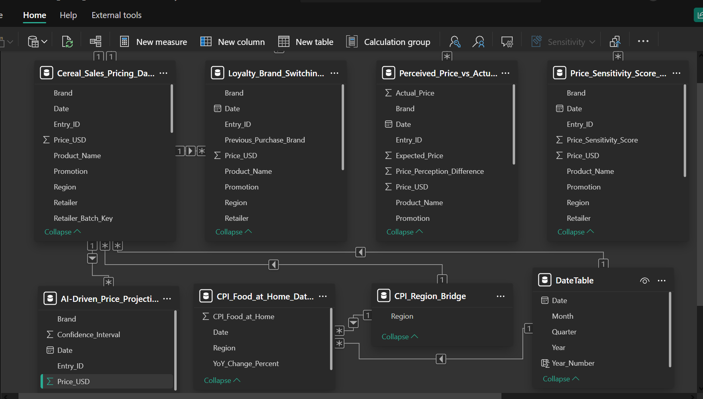

# 🧠 Power BI Data Model Strategy & Relational Design

### 🧱 Why a Solid Data Model Matters

The Power BI data model is the **engine behind the insights** in the Cereal Market Evolution project. A well-structured model allows for **accurate cross-table analysis**, **efficient DAX calculations**, and **dynamic interactivity**. It ensures seamless integration of diverse datasets like pricing, brand switching, price sensitivity, and CPI—all while maintaining performance.

---

## 🗂️ Core Tables & Relational Design

The data model is centered around a **primary fact table**:  
 `Cereal_Sales_Pricing_Dataset_Corrected`  
This table serves as the **anchor for all other analytical tables** through the `Retailer_Batch_Key` and `Entry_ID`.

### 🔁 One-to-Many Relationships

- All supporting datasets (loyalty, perceived price, CPI, AI forecasts) connect via **one-to-many relationships** to the core sales table.
- This ensures **referential integrity**, **minimized data duplication**, and **modular insight layering**.

---

## 📅 The Purpose of the `DateTable`

The `DateTable` enables **time intelligence** in Power BI:  
✅ Supports calculations like **YoY trends**, **seasonality**, and **time-based filtering**  
✅ Provides **hierarchical time slicing** (Year > Quarter > Month)  
✅ Linked using a **one-to-many relationship on the `Date` field** across all datasets

**Why it matters:**  
Without a proper `DateTable`, DAX time functions (like `TOTALYTD`, `SAMEPERIODLASTYEAR`, `DATEADD`) cannot be used effectively.

---

## 🔁 The Role of `CPI_Region_Bridge`

The `CPI_Region_Bridge` table connects CPI trends to the sales and pricing datasets.  
✅ Bridges the CPI inflation data (`CPI_Food_at_Home_Dataset`) to multiple retail regions  
✅ Uses a **one-to-many relationship on `Region`** to enable accurate inflation comparisons  
✅ Allows for CPI overlay analysis without duplicating region entries across tables

---

## 💡 Data Modeling Decisions: Cardinality & Strategy

- **Cardinality:** Most relationships use **one-to-many (1:* cardinality)** for optimized joins and filter flow.
- **Star Schema Approach:** Core fact table surrounded by multiple dimension and lookup tables.
- **Normalization:** Reduces redundancy while maximizing query performance and model clarity.

---

## 🧩 Full Data Model View

Below is a visual representation of the full Power BI data model. This layout reflects a **strategically layered model**, enabling robust analysis of inflation, price perception, brand behavior, and sales dynamics.

---

## 🔎 Strategic Insight

> A strong data model isn’t just technical—it’s strategic.  
> It empowers your dashboards to **scale**, your DAX to **run fast**, and your stakeholders to **trust the insights.**
