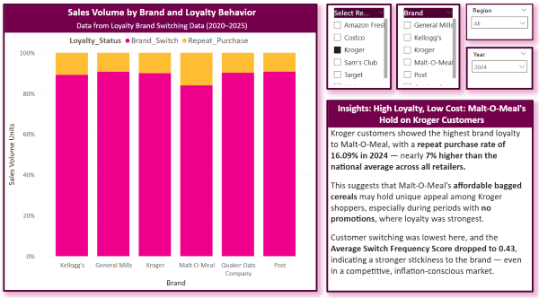

# Strategic Recommendation: Malt-O-Meal (MOM) – Loyalty & Budget Brand Outperformance

---

## Business Question / Purpose of Analysis

**Which cereal brands show the highest consumer loyalty during inflationary periods, and how does this behavior vary across budget vs. premium or store-brand categories?**

This analysis was designed to answer a core strategic question for both CPG firms and retailers:  
> **Are budget-conscious shoppers loyal to low-cost cereal brands, or are they simply switching based on price?**  

Understanding **brand stickiness versus price-driven switching** helps inform product positioning, pricing resilience strategies, and promotional planning in high-inflation environments.

---

## Embedded Visuals

### 🔹 Loyalty Sales Volume by Brand – 2024 (Kroger Focus)

### 🔹 MOM Product-Level Loyalty & Switch Behavior

---

# Executive Summary

The loyalty and brand switching data for 2024 reveals **Malt-O-Meal (MOM)** as a **standout performer among value-priced cereal brands**, particularly at **Kroger**. Despite being a national budget brand, MOM consistently outperforms both private label store brands and more established legacy brands like Quaker in key loyalty metrics.

- **Repeat Purchase Rate at Kroger (2024):** 16.09% (Highest across all brands)
- **Switch Frequency Score:** 0.43 (Indicating low churn and high stickiness)
- **Top-performing Product:** MOM Frosted Flakes (repeat rate ~19.7%)

This insight suggests MOM has built **strong intrabrand loyalty**, where customers not only return to the brand but often repurchase the *same product variant*. This level of consumer “stickiness” is rare among budget brands and signals a competitive advantage in both pricing and perceived value.

---

## 🧩 Behavioral & Market Psychology Insight

From a consumer psychology perspective, **MOM has achieved the holy grail of value branding**—it delivers affordability without triggering the “compromise effect” often seen with budget products.

Consumers typically associate low price with lower quality, but MOM seems to bypass this through:
- Familiar packaging (visually echoing national brands)
- Consistent taste performance
- Widespread shelf availability at trusted retailers like Kroger

This results in **anchored loyalty**, where buyers don’t view MOM as a downgrade but rather as a “smart choice”—especially in inflationary periods.

---

##  Strategic Recommendations

### 🔹 For MOM (Post Consumer Brands)
1. **Double Down on Product Stickiness**
   - Promote hero products (like Froted Flakes and Berry Colossal Crunch) as “Smart Choice Favorites”
   - Use in-store and digital ads to reinforce taste and value messaging

2. **Expand Loyalty-Oriented Messaging**
   - Highlight “Chosen Again and Again” in packaging or promos
   - Emphasize repeat buyer stats in Kroger co-branded campaigns

3. **Leverage Retail Partnerships**
   - Collaborate with Kroger for loyalty card insights and targeted promotions
   - Consider “Buy 2 Save $1” campaigns to drive multi-unit purchasing of sticky SKUs

---

### 🔹 For Competing Brands (e.g., Quaker, Store Brands)
1. **Study MOM’s Perceived Value Positioning**
   - Consumers may not be switching for price alone, but for perceived satisfaction
   - Competitive strategy must address **taste trust + value**, not just discounts

2. **Invest in Differentiation**
   - For premium brands like Quaker: explore texture, health, or premium packaging angles
   - For store brands: highlight exclusive formulations or benefits to rebuild loyalty

---

## Strategic Impact

**Why it matters:**  
In a market where inflation and shrinkflation are changing how consumers evaluate value, **MOM’s ability to secure repeat purchases without being the lowest-cost option** is a powerful differentiator. This insight can guide **portfolio strategy, promotion planning, and brand messaging** across the budget to mid-tier price spectrum.

---
