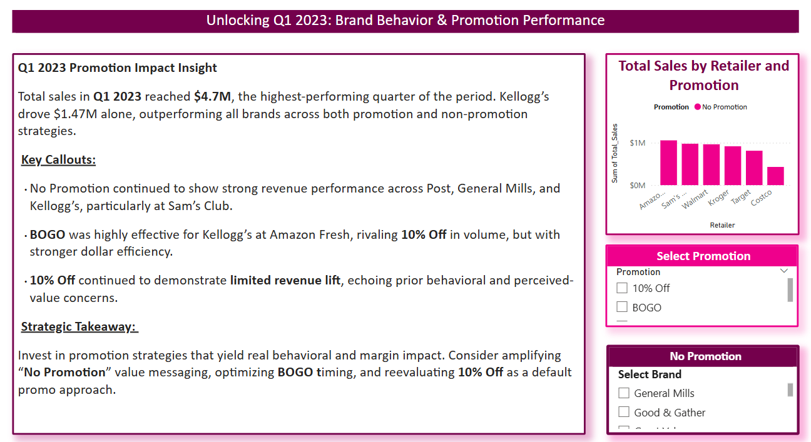
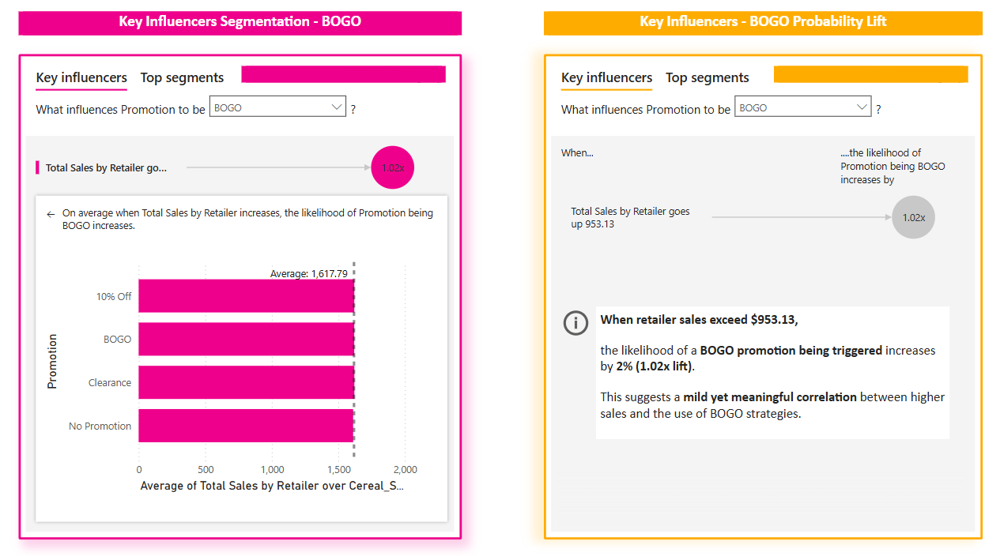

# Strategic Recommendation  
## Promotion-Based Behavioral Targeting & BOGO Trigger Optimization

---

## 🧩 Business Question:
How can retailers and consumer packaged goods (CPG) brands use **behavioral patterns in promotion response** to optimize pricing strategies and trigger promotions more effectively?

---

## Purpose of the Analysis:
To uncover when and how consumers respond to different types of promotions (No Promotion, BOGO, 10% Off, Clearance) and determine what retailer performance thresholds correlate with **triggering specific promo types** — particularly **BOGO offers**.

---

## Executive Summary:
The analysis of **Q1 2023 sales performance** and **probability lift modeling** revealed that:

- **No Promotion** periods outperformed 10% Off discounts in revenue across multiple brands.
- **BOGO promotions** become **2% more likely** to be triggered when retailer sales surpass **$953.13** — signaling a behavioral threshold that aligns with real-world sales conditions.
- **10% Off** promotions showed **limited behavioral impact** — often underperforming against both BOGO and No Promo scenarios.

> Retailer and consumer behavior reflect **strategic intent**, not random discounting.

---

## Key Observations:

| Behavior | Insight |
|----------|---------|
| No Promotion | Strong revenue in Q1 2023 across Kellogg’s, General Mills, and Post, especially at Sam’s Club and Kroger |
| BOGO | High efficiency when triggered at Amazon Fresh for Kellogg’s; 1.02x likelihood increase when retailer sales > $953 |
| 10% Off | Repeatedly underperformed across both sales volume and expected price satisfaction |
| Clearance | Effective only in isolated retailer-brand cases with low margin products |

---

## 👥 Stakeholder Use Cases

**Retail Pricing Teams**  
- Use probability lift signals to **pre-plan promo activations** tied to sales thresholds  
- Optimize promo calendars around **trigger-based behavioral moments**

**CPG Brand Strategists**  
- Align co-funded promotions (like BOGO) with **performance bands**  
- Reframe “No Promotion” as a strategic play during inflation or habitual product cycles

**Marketing & Merchandising Leads**  
- Rethink value messaging: Not all discounts are perceived as value  
- Target BOGO for loyalty-primed or bulk-buy audiences

---

## 💼 Strategic Recommendations

1. **Reframe “No Promotion” as a Value Signal**  
   Consumers are responding to familiar, necessity-driven brands even without discounting — lean into that with value-based messaging and positioning.

2. **Use BOGO Strategically, Not Universally**  
   Trigger BOGO only when volume efficiency, retailer readiness, and brand loyalty align — especially as sales exceed $950–$1000+ per cycle.

   

3. **Reevaluate “10% Off” as Default Discounting Strategy**  
   If consumers perceive small discounts as negligible, they may delay purchases or ignore promos altogether. Replace with more behaviorally effective triggers or time-sensitive scarcity plays.

4. **Incorporate Probability Lift Models into Pricing Reviews**  
   Integrate influencer visualizations and segmentation modeling into pricing dashboards to uncover invisible behavioral signals.

---

## 🌐 Strategic Impact

✅ **Maximized Promo ROI** — fewer unnecessary discounts  
✅ **Improved Inventory Control** — promotions activated at the right moment  
✅ **Stronger Brand Loyalty** — through psychological trust-building (No Promo strategy)  
✅ **Increased Sales Predictability** — by using behavioral thresholds like 1.02x BOGO lift as planning signals

> "Promotions aren’t just marketing levers — they are **behavioral mirrors.** When used strategically, they don’t just respond to demand, they **shape it.**"

---

📁 **File Path:**  
`/Strategic_Recommendations/promo_behavioral_targeting_recommendations.md`

🖼️ **Visual References:**  
- `../Images/Q1_2023_Promotion_Impact_Insight.png`  
- `../Images/Key_Influencers_BOGO.png`

---
