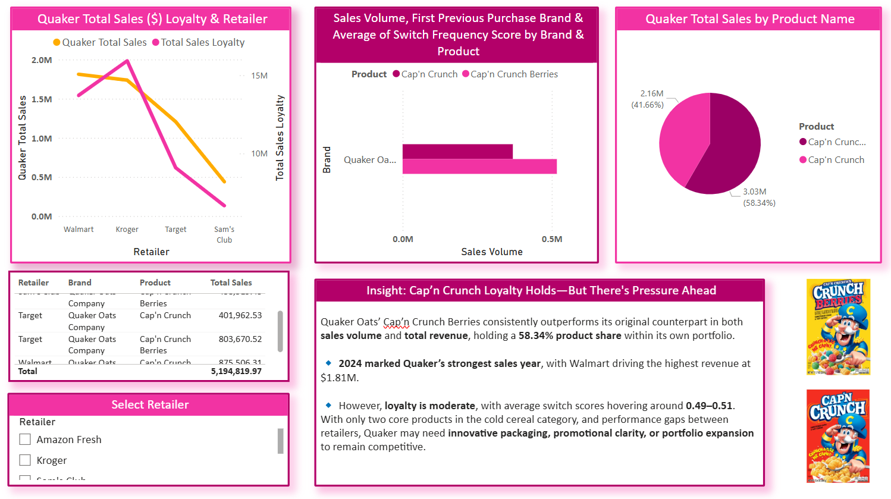
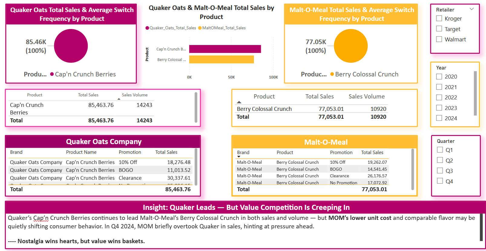

# Strategic Recommendation: Quaker Oats – Loyalty Gap & Value Brand Threat

---

## Business Question / Purpose of Analysis

**"How is Quaker Oats performing in brand loyalty and sales retention, and what competitive pressure is emerging from lower-priced alternatives like Malt-O-Meal?"**

This analysis aims to understand the **consumer loyalty landscape** for premium legacy brands like Quaker and assess whether **value-driven competition** is eroding market share — especially during inflationary cycles. By comparing Quaker’s loyalty metrics against budget brands, we identify strategic risks and recovery opportunities.

---

## 📊 Embedded Visuals

### 🔹 Quaker Performance: Sales, Loyalty, and Retailer Breakdown  

### 🔹 Quaker vs. MOM Loyalty & Sales Performance  

---

## Executive Summary

While **Quaker Oats** maintains strong overall brand recognition, the data shows **moderate loyalty performance** and **signs of vulnerability** across retail channels.  

- **Switch Frequency Score:** Between **0.49 and 0.51**, indicating moderate loyalty with room for improvement  
- **Top Product:** *Cap’n Crunch Berries*, holding **58.34%** of Quaker's internal share  
- **2024 Revenue Peak:** Driven by Walmart, totaling **$1.81M**  
- **Loyalty Drop-Off:** Significant decline at **Target** and **Sam’s Club**, both in sales and repeat rate  

Comparatively, **Malt-O-Meal’s Berry Colossal Crunch** is gaining traction, narrowing the sales gap and achieving **strong loyalty signals at lower price points**.

---

## 🧩 Behavioral & Market Psychology Insight

Quaker’s long-standing brand equity is being challenged not by premium competitors, but by **value brands that offer nostalgic familiarity at a lower cost**.  

Consumers who grew up with Cap’n Crunch may still love the brand, but when faced with tight grocery budgets, many will swap for a similar experience if the price and taste align.

> **“Nostalgia wins hearts, but value wins baskets.”**

This insight captures a key psychological shift in buyer behavior — where even iconic brands must now justify premium pricing with **product differentiation, innovation, or emotional relevance.**

---

## Strategic Recommendations

### 🔹 For Quaker Oats Company
1. **Reinforce Emotional Branding**
   - Double down on nostalgic campaigns — highlight history, family, and heritage
   - Launch limited-edition packaging with retro branding or collector promotions

2. **Repackage & Reprice Select SKUs**
   - Introduce mid-sized options to close the affordability gap
   - Explore BOGO or bundle strategies for Cap’n Crunch during Q4 high-volume months

3. **Product Line Expansion or Reinvention**
   - Create new flavor variations or seasonal SKUs to spark consumer interest
   - Consider licensing/partnerships (e.g., holiday collabs, snack crossover versions)

4. **Target Retailer-Specific Campaigns**
   - Partner with retailers where loyalty is dropping (e.g., Target) to offer exclusive promotions or shopper incentives

---

### 🔹 For Competing Value Brands (e.g., MOM, Store Brands)
1. **Capitalize on Taste + Price Positioning**
   - Highlight taste tests, price-per-ounce savings, and satisfaction ratings  
   - Continue promoting “Smart Switch” narratives in shelf talkers or ads

2. **Introduce Competing SKUs**
   - Extend into adjacent product lines that mimic Quaker’s nostalgia-based portfolio
   - Use playful branding to increase shelf appeal for younger families

---

## Strategic Impact

Quaker’s loyalty is **not failing — but it’s fading**. As budget-conscious shoppers redefine value, premium brands must evolve their storytelling, pricing structures, and promotional strategies. If not, they risk being quietly replaced by brands that **don’t have the legacy—but win on logic and price.**

---

### 📁 Project Structure Reference

- 📄 *File Path:* `/Strategic_Recommendations/quaker_oats_loyalty_gap_strategy.md`  
- 🖼 *Visuals Folder:* `/Images/`  
- 🔗 *Referenced Insight:* [QOC vs MOM Loyalty Markdown](../Insights/insights/QOC_vs_MOM_Loyalty_Sales.md)
